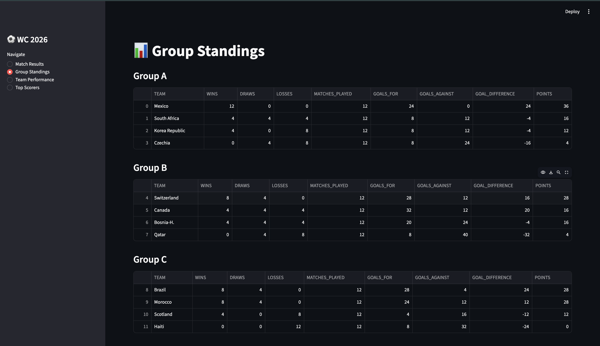
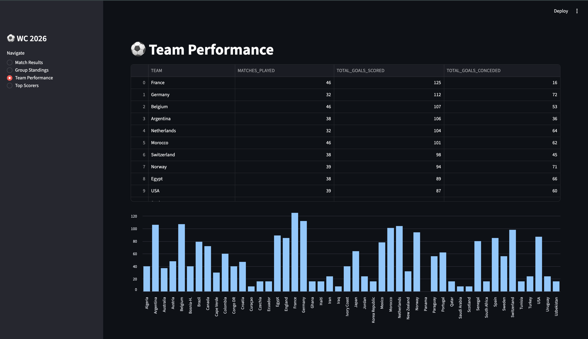
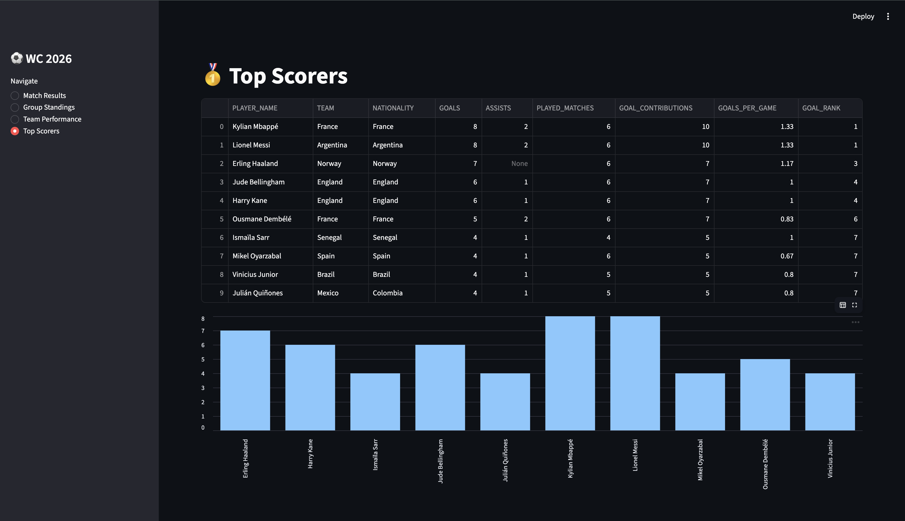

# 2026 World Cup Live Data Engineering Pipeline

I built this project because I wanted to combine two things I genuinely care about — 
soccer and data engineering. The 2026 World Cup is happening right now across the US, 
Canada, and Mexico, and I wanted to build something that captures that energy in real 
time rather than working with stale CSV files like most portfolio projects.

The idea was simple: every time a match ends, every time a goal is scored, every time 
the group standings shift — I wanted that data flowing through a production-grade pipeline 
and landing in a dashboard within the hour. No manual downloads. No static datasets. 
Live data, automated pipeline, real insights.

This is not a tutorial project. Every architectural decision was made deliberately, 
every tool was chosen because it reflects what modern data engineering teams actually use, 
and every problem I hit along the way taught me something I could not have learned 
from a course.

## What this pipeline does

Match data is pulled from the football-data.org API every time the pipeline runs. 
Producers publish each match as a structured message to Apache Kafka topics running 
locally in Docker. A consumer reads from those topics and writes JSON files to AWS S3, 
which acts as the raw landing zone. Apache Airflow orchestrates the load from S3 into 
Snowflake using COPY INTO, where the data lands in a raw VARIANT column exactly as it 
arrived. From there, dbt staging models parse the JSON into typed columns, and dbt mart 
models build the analytical tables the dashboard reads from. The whole thing runs on 
a schedule so the data stays current throughout the tournament.

## Tech stack

- Apache Kafka and Docker for real-time message streaming
- AWS S3 for object storage between streaming and the warehouse
- Apache Airflow for orchestration and scheduling
- Snowflake as the cloud data warehouse with a three-layer medallion architecture
- dbt for SQL-based transformations, testing, and documentation
- Streamlit for the live dashboard
- GitHub Actions for CI/CD

## Data architecture

The pipeline follows a medallion architecture across three Snowflake databases:

RAW_WC2026 holds untouched JSON exactly as it arrived from the API. Nothing is 
modified here. If something goes wrong downstream, this layer is the source of truth 
for reloading.

STAGING_WC2026 is where dbt staging models parse the raw JSON VARIANT columns into 
typed, named columns. This is the first point where the data becomes queryable like 
a normal table.

MARTS_WC2026 contains the analytical models the dashboard reads from — group 
standings, match results, team performance, and the top scorers leaderboard.

## Pipeline flow

football-data.org API
        |
        v
Kafka producers (match events, player scores)
        |
        v
AWS S3 (raw JSON files organized by match ID)
        |
        v
Airflow DAG (COPY INTO Snowflake)
        |
        v
Snowflake RAW layer (VARIANT columns)
        |
        v
dbt staging models (JSON parsing, type casting)
        |
        v
dbt mart models (group standings, results, performance, scorers)
        |
        v
Streamlit dashboard (live insights)

## Project structure

producers/          Kafka producer scripts for match events and player scores
consumer/           Kafka consumer that writes messages to AWS S3
docker/dags/        Airflow DAGs for orchestration
wc2026_dbt/         dbt project with staging and mart models
streamlit_app/      Streamlit dashboard
schemas/            Avro schema definitions
.github/workflows/  CI/CD pipelines

## Dashboard

The Streamlit dashboard shows four views built directly from the Snowflake mart layer:
match results with home/away/draw outcomes, group standings with points and goal 
difference, team performance comparing goals scored vs conceded, and a top scorers 
leaderboard with goals per game ratios and goal contributions.

## Dashboard Screenshots

Match results showing all finished games with home/away/draw outcomes:

Group standings broken down per group with points, goal difference, and wins:

Team performance comparing total goals scored vs conceded across the tournament:

Top scorers leaderboard with goals per game ratio and goal contributions:

## What I learned

Building this end to end taught me things no course covers — how Kafka advertised 
listeners affect host-to-container connectivity, why Snowflake VARIANT columns and 
schema-on-read patterns make JSON pipelines resilient to API changes, how dbt's 
generate_schema_name macro prevents schema concatenation issues, and why the 
difference between docker-compose restart and docker-compose down/up matters when 
environment variables change.

The pipeline is imperfect and I know exactly why — which is more valuable than a 
polished tutorial project where everything works because someone else already solved 
the hard problems.